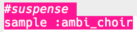

## تشويق

دعونا نبدأ بإنشاء صوت لإظهار أن الخطر يقترب.

+ لإنشاء التأثير الخاص الأول يجب عليك إضافة العينة `:ambi_choir` إلى المخزن المؤقت الفارغ.

    

+ يمكنك تغيير معدل **0** الذي يتم فيه تشغيل العينة. معدل من `1` هو السرعة العادية للعيّنة، وباستخدام `معدل` أقل من 1 سيبطئ العينة إلى الأسفل.

    

+ اضغط على 'تشغيل' لسماع العينة الخاصة بك ببطء. كيف يبدو صوت العينة؟

+ `معدل` أعلى من 1 تسرع العينة.

    

+ اختبر العينة الخاصة بك مرة أخرى. كيف يبدو صوته الان؟

+ يمكنك تكرار العينة عدة مرات عن طريق وضعها في حلقة تكرارية. ستحتاج أيضًا إلى إضافة `نوم` بعد تشغيل العينة.

    
