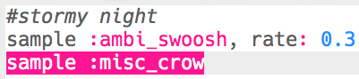

## ليلة عاصفة

+ اختر مخزن مؤقت فارغ لإنشاء التأثير الخاص التالي.

+ للبدء، أضف العينة `:ambi_swoosh`.
    
    

+ اضغط على 'تشغيل' لاختبار العينة الخاصة بك لترى كيف يبدو صوتها.

+ إذا أبطأت صوت العينة ، ستسمع أنها تبدو وكأنها عاصفة.
    
    

+ يمكنك أيضًا إضافة عينة `:misc_crow` التي يتم تشغيلها في نفس الوقت.
    
    

+ ضع العينة `:misc_crow` في حلقة التكرار، لذلك يتم تشغيلها 4 مرات مع 1 نبضة `نوم` في كل مرة يتم فيها تشغيلها.
    
    

+ بدلاً من النوم لمدة نبضة واحدة في كل مرة، يمكنك استخدام `rrand` الذي سيعطيك رقما عشوائيا بين القيمتين في أقواس معقوفة.
    
    

+ السعة ** ** الصوت هو حجم الموجة الصوتية. تغيير سعة الموجة الصوتية يغير حجمها **الحجم**.
    
    
    
    يمكنك استخدام `amp` لإعداد عينة تشغيل بحجم مختلف. عدد أقل من 1 سوف يشغل العينة بصورة هادئة.
    
    