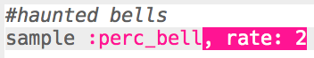
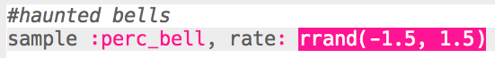

## أجراس ممسكة

+ اختر مخزن مؤقت فارغ لإنشاء التأثير الخاص التالي.

+ ابدأ بإضافة العينة `:perc_bell`.
    
    

+ اضغط على 'تشغيل' لاختبار العينة الخاصة بك لترى كيف يبدو صوتها.

+ قم بتغيير معدل `` من العينة لترى كيف يتم تشغيل الأصوات بسرعات مختلفة.
    
    

+ تغيير معدل `` إلى `-1`. ماذا يفعل هذا للعينة؟
    
    

+ يمكنك استخدام `rrand` لتشغيل العينة بمعدل عشوائي.
    
    

+ أضف العينة إلى حلقة تكرار **للأبد**. يمكنك أيضًا استخدام `النوم ` لفترة عشوائية بعد تشغيل العينة.
    
    