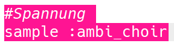
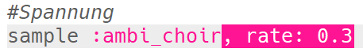
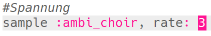
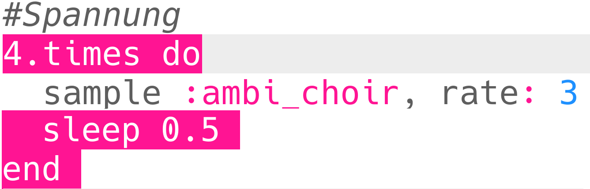

## Spannung

Beginnen wir mit einem Sound, der zeigt, dass sich die Gefahr nähert.

+ Um den ersten Spezialeffekt zu erstellen, sollten Sie das Sample `: ambi_choir` zu einem leeren Puffer hinzufügen.
    
    

+ Sie können die **Rate** ändern, mit der ein Sample abgespielt wird. Eine `Rate` von `1` ist die Normalgeschwindigkeit der Probe, und die Verwendung einer `Rate` von weniger als 1 verlangsamt die Probe.
    
    

+ Drücken Sie 'Run', um zu hören, wie Ihr Sample langsam abgespielt wird. Wie klingt das Sample?

+ Eine `Rate` höher als 1 beschleunigt die Probe.
    
    

+ Testen Sie Ihre Probe erneut. Wie klingt es jetzt?

+ Sie können das Sample einige Male wiederholen, indem Sie es in eine Schleife schreiben. Sie müssen außerdem eine `Schlaf` hinzufügen, nachdem Sie das Sample abgespielt haben.
    
    