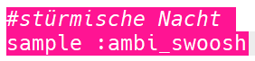
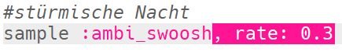
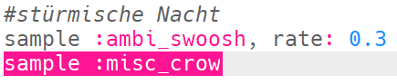
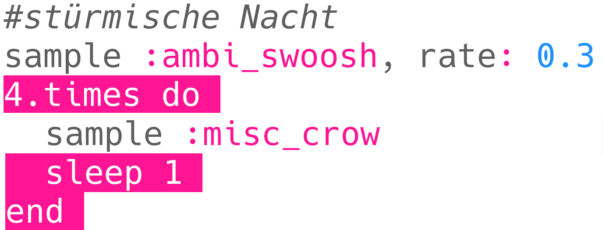
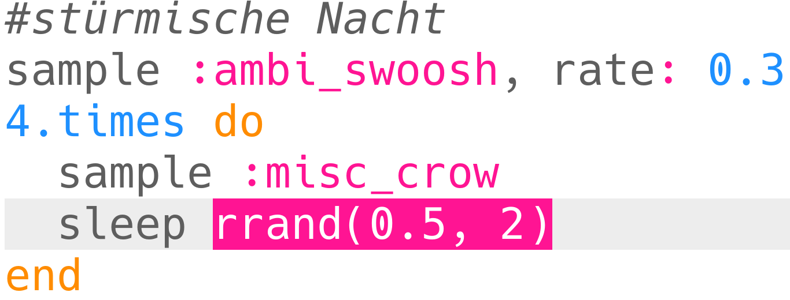
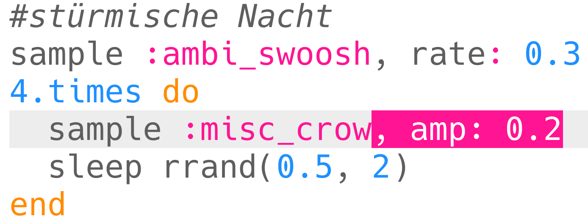

## Stürmische Nacht

+ Wählen Sie einen leeren Puffer, um den nächsten Spezialeffekt zu erstellen.

+ Fügen Sie das `: ambi_swoosh` Sample hinzu.
    
    

+ Klicken Sie auf "Run", um Ihr Sample zu testen und zu sehen, wie es klingt.

+ Wenn Sie das Sample langsamer machen, hören Sie, dass es wie ein Sturm klingt.
    
    

+ Sie können auch ein `: misc_crow` Sample hinzufügen, das gleichzeitig abgespielt wird.
    
    

+ Setzen Sie das `: misc_crow` Sample in eine Schleife, so dass es bei jeder Wiedergabe 4-mal mit 1 Beat `sleep` gespielt wird.
    
    

+ Anstatt für jeweils 1 Beat zu schlafen, können Sie `Rrand` , um eine Zufallszahl zwischen den 2 Werten in Klammern zu erhalten.
    
    

+ Die **Amplitude** eines Klangs ist die Größe der Schallwelle. Ändern der Amplitude einer Schallwelle ändert seinen **Volumen**.
    
    
    
    Sie können `Amp` , um ein Sample mit einer anderen Lautstärke abzuspielen. Bei einer Zahl unter 1 wird ein Sample leiser abgespielt.
    
    