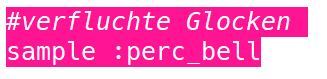
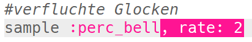
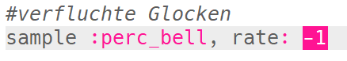
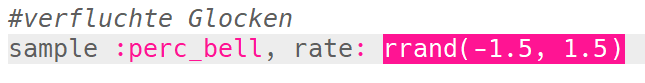
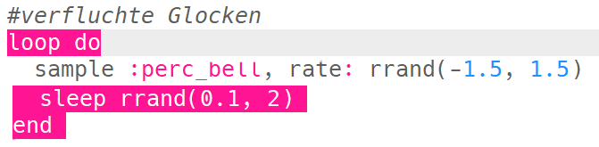

## Verfluchte Glocken

+ Wähle einen leeren Puffer, um den nächsten Spezialeffekt zu erstellen.

+ Füge zuerst das `:perc_bell` Sample hinzu.
    
    

+ Drücke 'Run', um das Sample abzuspielen und zu sehen, wie es klingt.

+ Ändere die `rate` des Samples, um zu sehen, wie es sich anhört, wenn es mit verschiedenen Geschwindigkeiten abgespielt wird.
    
    

+ Ändere die `rate` zu `-1`. Was macht das mit dem Sample?
    
    

+ Du kannst `rrand` verwenden, um das Sample mit einer Zufallsrate abzuspielen.
    
    

+ Füge das Sample zu einer Schleife hinzu, die sich **für immer wiederholt.**. Du kannst das Program, nach dem Abspielen des Samples, für eine zufällige Zeit schlafen lassen, indem du den `sleep`-Befehl verwendest.
    
    