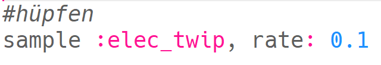
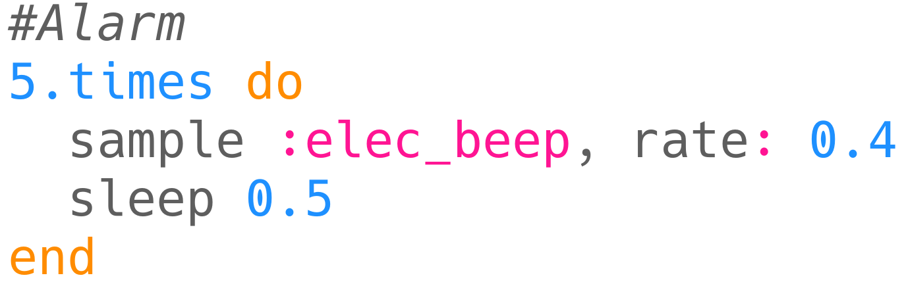

\--- challenge \---

## Herausforderung: Erstelle deine eigenen Spezialeffekte

Kannst du Samples verwenden, um deine eigenen Spezialeffekte zu erstellen? Hier sind einige Beispiele, um dir zu helfen:

Denke daran, dass Du deine Effekte auch **aufnehmen** kannst (über die record-Schaltfläche) und sie in einem Film oder einem Spiel, das Du entwickelst, verwenden kannst!

\--- /challenge \---