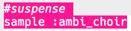

## Αγωνία

Ας ξεκινήσουμε δημιουργώντας έναν ήχο για να δείξουμε ότι πλησιάζει ο κίνδυνος.

+ Για να δημιουργήσεις το πρώτο ειδικό εφέ θα πρέπει να προσθέσεις το δείγμα `:ambi_choir` στον κενό κώδικα.

    

+ You can change the __rate__ at which a sample is played. A `rate` of `1` is the sample's normal speed, and using a `rate` of less than 1 will slow the sample down.

    

+ Press 'Run' to hear your sample played slowly. How does the sample sound?

+ Ένα `rate` υψηλότερο από 1 επιταχύνει το δείγμα.

    

+ Test your sample again. How does it sound now?

+ You can repeat the sample a few times by putting it in a loop. You'll also need to add a `sleep` after playing the sample.

    
