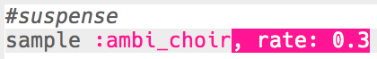

## Αγωνία

Ας ξεκινήσουμε δημιουργώντας έναν ήχο για να δείξουμε ότι πλησιάζει ο κίνδυνος.

+ Για να δημιουργήσεις το πρώτο ειδικό εφέ θα πρέπει να προσθέσεις το δείγμα `:ambi_choir` στον κενό κώδικα.
    
    

+ Μπορείς να αλλάξεις τον ρυθμό **rate** στον οποίο παίζεται ένα δείγμα. Ο ρυθμός `rate` από `1` είναι η κανονική ταχύτητα του δείγματος και η χρήση `rate` μικρότερου από 1 θα επιβραδύνει το δείγμα.
    
    

+ Πάτησε «Run» για να ακούσεις το δείγμα σου να αναπαράγεται αργά. Πώς ακούγεται το δείγμα;

+ Ένα `rate` υψηλότερο από 1 επιταχύνει το δείγμα.
    
    

+ Δοκίμασε το δείγμα σου ξανά. Πώς ακούγεται τώρα;

+ Μπορείς να επαναλάβεις το δείγμα μερικές φορές τοποθετώντας το σε βρόχο. Θα χρειαστεί επίσης να προσθέσεις αναμονή (`sleep`) μετά την αναπαραγωγή του δείγματος.
    
    