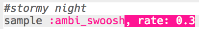
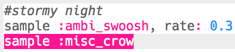
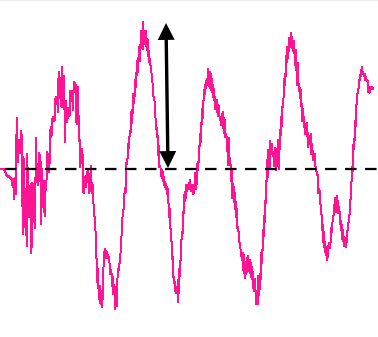

## Stormy night (Νύχτα με καταιγίδα)

+ Επίλεξε ένα κενό πρόγραμμα για να δημιουργήσεις το επόμενο ειδικό εφέ.

+ Για να ξεκινήσεις, πρόσθεσε το δείγμα `:ambi_swoosh`.
    
    

+ Πάτησε «Run» για να ελέγξεις το δείγμα σου και να δεις πώς ακούγεται.

+ Εάν επιβραδύνεις το δείγμα, θα ακούσεις ότι ακούγεται σαν καταιγίδα.
    
    

+ Θα μπορούσες επίσης να προσθέσεις ένα δείγμα `:misc_crow`, το οποίο παίζεται ταυτόχρονα.
    
    

+ Βάλε το δείγμα `:misc_crow` σε έναν βρόχο, ώστε να παίζεται 4 φορές με αναμονή `sleep` 1 χτύπο κάθε φορά που παίζει.
    
    

+ Αντί να περιμένεις για 1 χτύπο κάθε φορά, μπορείς να χρησιμοποιήσεις το `rrand`, στο οποίο θα σου δίνεται ένας τυχαίος αριθμός μεταξύ των 2 τιμών σε αγκύλες.
    
    

+ Το πλάτος (**amplitude**) ενός ήχου είναι το μέγεθος του ηχητικού κύματος. Η αλλαγή του πλάτους ενός ηχητικού κύματος αλλάζει την ένταση (**volume**).
    
    
    
    Μπορείς να χρησιμοποιήσεις το `amp` για να κάνεις ένα δείγμα να παίζει με διαφορετική ένταση. Ένας αριθμός μικρότερος από 1 θα παίξει ένα δείγμα με χαμηλότερη ένταση.
    
    