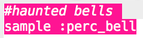

## Στοιχειωμένες Καμπάνες

+ Επίλεξε ένα κενό buffer για να δημιουργήσεις το επόμενο ειδικό εφέ.

+ Ξεκίνα προσθέτοντας το δείγμα `:perc_bell`.

    

+ Πάτησε «Run» για να ελέγξεις το δείγμα σου και να δεις πώς ακούγεται.

+ Άλλαξε το `rate` του δείγματος για να δεις πώς ακούγεται σε διαφορετικές ταχύτητες.

    

+ Change the `rate` to `-1`. What does this do to the sample?

    

+ Μπορείς να χρησιμοποιήσεις το `rrand` για να παίξεις το δείγμα με τυχαίο ρυθμό.

    

+ Add the sample to a loop that repeats __forever__. You can also `sleep` for a random time after the sample is played.

    

