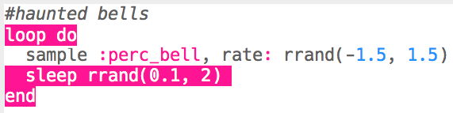

## Στοιχειωμένες Καμπάνες

+ Επίλεξε ένα κενό buffer για να δημιουργήσεις το επόμενο ειδικό εφέ.

+ Ξεκίνα προσθέτοντας το δείγμα `:perc_bell`.
    
    

+ Πάτησε «Run» για να ελέγξεις το δείγμα σου και να δεις πώς ακούγεται.

+ Άλλαξε το `rate` του δείγματος για να δεις πώς ακούγεται σε διαφορετικές ταχύτητες.
    
    

+ Άλλαξε το `rate` σε `-1`. Τι κάνει αυτό στο δείγμα;
    
    

+ Μπορείς να χρησιμοποιήσεις το `rrand` για να παίξεις το δείγμα με τυχαίο ρυθμό.
    
    

+ Βάλε το δείγμα σε έναν βρόχο που επαναλαμβάνει **για πάντα**. Μπορείς επίσης να περιμένεις (`sleep`) για τυχαίο χρόνο μετά την αναπαραγωγή του δείγματος.
    
    