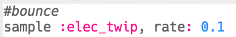
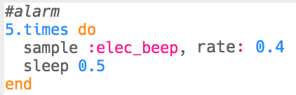

--- challenge ---

## Πρόκληση: Δημιούργησε τα δικά σου ειδικά εφέ

Μπορείς να χρησιμοποιήσεις δείγματα για να δημιουργήσεις τα δικά σου ειδικά εφέ; Ακολουθούν ορισμένα παραδείγματα που θα σε βοηθήσουν:

Να θυμάσαι ότι μπορείς να καταγράφεις με το **rec** τα αποτελέσματα και να τα χρησιμοποιήσεις σε μια ταινία ή το παιχνίδι που φτιάχνεις!

--- /challenge ---

***
Το έργο αυτό μεταφράστηκε από τους εθελοντές:

Αλέξανδρος Ρονιώτης (Σύλλογος ΨηφίΔα)

Κυριακή Ιντζεΐδου

Χάρη στους εθελοντές, μπορούμε να δώσουμε σε ανθρώπους σε όλο τον κόσμο την ευκαιρία να μάθουν στη γλώσσα τους. Μπορείτε να μας βοηθήσετε να προσεγγίσουμε περισσότερους ανθρώπους μεταφράζοντας εθελοντικά - περισσότερες πληροφορίες στο [rpf.io/translate](https://rpf.io/translate).