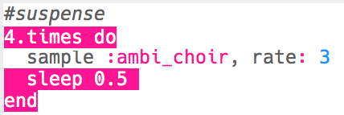

## Suspense
Let's start by creating a sound to show that danger is approaching.

+ To create the first special effect you should add the `:ambi_choir` sample to am empty buffer.

    

+ You can change the __rate__ at which a sample is played. A `rate` of `1` is the sample's normal speed, and using a `rate` of less than 1 will slow the sample down.

    

+ Press 'Run' to hear your sample played slowly. How does the sample sound?

+ A `rate` higher than 1 speeds the sample up.

    

+ Test your sample again. How does it sound now?

+ You can repeat the sample a few times by putting it in a loop. You'll also need to add a `sleep` after playing the sample.

    

### Additional information for club leaders

If you need to print this project, please use the [Printer friendly version](https://projects.raspberry-pi.org/en/projects/special-effects/print).

--- collapse ---
---
title: Club leader notes
---

## Introduction:
In this project, children will learn how to manipulate samples to create spacial effects.

## Resources
The 'Project Materials' link for this project contains the following resources:

##### Club leader Resources

You can find a completed version of this project by clicking the 'Project Materials' link for this project, which contains:

+ suspense.txt
+ suspense.mp3
+ stormy-night.txt
+ stormy-night.mp3
+ haunted-bells.txt
+ haunted-bells.mp3

## Learning Objectives
+ Sonic Pi samples
+ Sample `rate` and `amp`
+ Using random values

This project covers elements from the following strands of the [Raspberry Pi Digital Making Curriculum](http://rpf.io/curriculum):

+ [Combine programming constructs to solve a problem.](https://www.raspberrypi.org/curriculum/programming/builder)

## Challenges
+ "Create your own special effects" - using samples to create special effects.

## Frequently Asked Questions
+ To find samples available in Sonic Pi, learners can go to <a href="http://jumpto.cc/sonic-pi-samples">jumpto.cc/sonic-pi-samples</a>. Alternatively, they can just type `sample [space]` and choose from the list that appears.

--- /collapse ---

--- collapse ---
---
title: Project materials
---

## Club leader resources
* [Downloadable completed Sonic Pi 'Suspense' special effecte](resources/suspense.txt)
* [Downloadable completed 'Suspense' mp3 file](resources/suspense.mp3)
* [Downloadable completed Sonic Pi 'Stormy night' special effect](resources/stormy-night.txt)
* [Downloadable completed 'Stormy night' mp3 file](resources/stormy-night.mp3)
* [Downloadable completed Sonic Pi 'Haunted bells' special effect](resources/haunted-bells.txt)
* [Downloadable completed 'Haunted bells' mp3 file](resources/haunted-bells.mp3)

--- /collapse ---