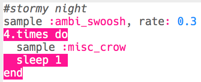

## Noche de tormenta

+ Elige un búfer vacío para crear el siguiente efecto especial.

+ Para empezar, añade la muestra `:ambi_swoosh`.
    
    

+ Presiona 'Run' para probar tu muestra y ver cómo suena.

+ Si reduces la velocidad de la muestra, escucharás que suena como una tormenta.
    
    

+ También puedes añadir una muestra `:misc_crow`, que se reproduce al mismo tiempo.
    
    

+ Pon la muestra `:misc_crow` en un bucle, para que se reproduzca 4 veces con 1 descanso `sleep` cada vez que se reproduzca.
    
    

+ En lugar de descansar durante 1 tiempo cada vez, puedes usar `rrand` para que te dé un número aleatorio entre los 2 valores entre paréntesis.
    
    

+ La ** amplitud ** de un sonido es el tamaño de la onda de sonido. Cambiando la amplitud de una onda de sonido cambia su **volumen**.
    
    
    
    Puedes usar `amp` para hacer que una muestra se reproduzca a un volumen diferente. Un número menor a 1 reproducirá una muestra más silenciosa.
    
    