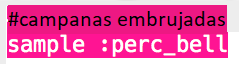
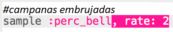
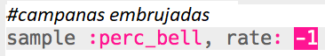
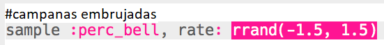
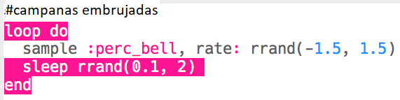

## Campanas embrujadas

+ Elige un búfer vacío para crear el siguiente efecto especial.

+ Comienza agregando la muestra `:perc_bell`.

    

+ Presiona 'Run' para probar tu muestra y ver cómo suena.

+ Cambie el `rate` de la muestra para ver cómo suena a diferentes velocidades.

    

+ Cambiar el `rate` a `-1`. ¿Qué le hace esto a la muestra?

    

+ Puedes usar `rrand` para reproducir la muestra a un ritmo aleatorio.

    

+ Agrega la muestra a un bucle que repita **para siempre**. También puedes `sleep` durante un tiempo aleatorio después de reproducir la muestra.

    

