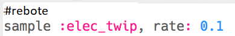
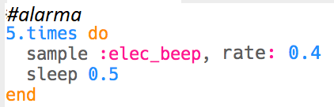

--- challenge ---

## Desafío: Crea tus propios efectos especiales

¿Puedes usar muestras para crear tus propios efectos especiales? Aquí hay algunos ejemplos para ayudarte:

Recuerda que puedes **grabar** tus efectos y usarlos en una película o juego que estás desarrollando!

--- /challenge ---

***
Este proyecto fue traducido por voluntarios:

Susana Elvira Orellana Palomino

Victor Elias Anhuaman Cordova

Gracias a los voluntarios, podemos dar a las personas de todo el mundo la oportunidad de aprender en su propio idioma. Puedes ayudarnos a llegar a más personas ofreciéndote como voluntario para traducir. Más información en [rpf.io/translate](https://rpf.io/translate).