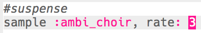

## Suspense

Let's start by creating a sound to show that danger is approaching.

+ To create the first special effect you should add the `:ambi_choir` sample to am empty buffer.
    
    

+ You can change the **rate** at which a sample is played. A `rate` of `1` is the sample's normal speed, and using a `rate` of less than 1 will slow the sample down.
    
    

+ Press 'Run' to hear your sample played slowly. How does the sample sound?

+ A `rate` higher than 1 speeds the sample up.
    
    

+ Test your sample again. How does it sound now?

+ You can repeat the sample a few times by putting it in a loop. You'll also need to add a `sleep` after playing the sample.
    
    