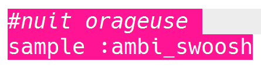
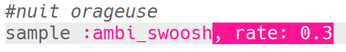
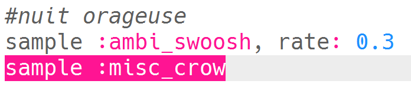
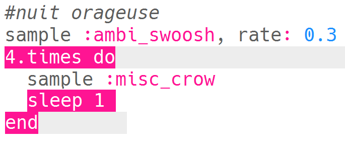
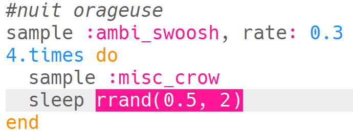
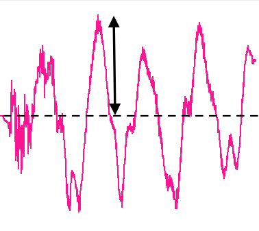
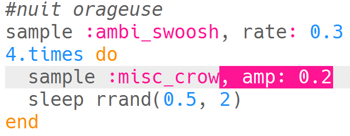

## Nuit orageuse

+ Choisis un tampon vide pour créer le prochain effet spécial.

+ Pour commencer, ajoute l'échantillon `:ambi_swoosh`.
    
    

+ Appuie sur « Run » pour tester ton échantillon et voir comment il sonne.

+ Si tu ralentis l'échantillon, tu entendras que cela ressemble à un orage.
    
    

+ Tu peux également ajouter un échantillon `:misc_crow` qui est joué en même temps.
    
    

+ Mets l'échantillon `:misc_crow` dans une boucle, de sorte qu'il soit joué 4 fois avec un battement `sleep` à chaque fois qu'il est joué.
    
    

+ Au lieu d'un sleep de 1 battement à chaque fois, tu peux utiliser `rrand` qui te donnera un nombre aléatoire entre les 2 valeurs entre parenthèses.
    
    

+ L' **amplitude** d'un son est la taille de l'onde sonore. Changer l'amplitude d'une onde sonore change son **volume**.
    
    
    
    Tu peux utiliser `amp` pour faire un échantillon de lecture à un volume différent. Un nombre inférieur à 1 jouera un échantillon plus silencieux.
    
    