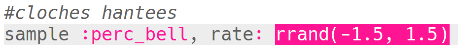

## Cloches hantées

+ Choisis un tampon vide pour créer le prochain effet spécial.

+ Commence par ajouter l'échantillon `:perc_bell`.
    
    

+ Appuie sur « Run » pour lire l'échantillon et voir comment il sonne.

+ Modifie le `taux` de l'échantillon pour voir comment il sonne joué à différentes vitesses.
    
    

+ Modifie le `taux` à `-1`. Qu'est-ce que cela fait à l'échantillon ?
    
    

+ Tu peux utiliser `rrand` pour jouer l'échantillon à un rythme aléatoire.
    
    

+ Ajoute l'échantillon à une boucle qui se répète **indéfiniment**. Tu peux aussi faire un `sleep` pendant une période aléatoire après que l'échantillon est joué.
    
    