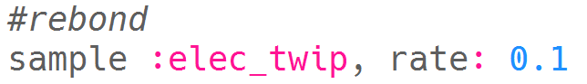

--- challenge ---

## Défi : créer tes propres effets spéciaux

Peux-tu utiliser des échantillons pour créer tes propres effets spéciaux ? Voici quelques exemples pour t'aider :

N'oublie pas que tu peux **enregistrer** tes effets et les utiliser dans un film ou un jeu que tu développes !

--- /challenge ---

***
Ce projet a été traduit par des bénévoles:

Jonathan Vannieuwkerke

Eric Verplanken

Grâce aux bénévoles, nous pouvons donner aux gens du monde entier la chance d'apprendre dans leur propre langue. Vous pouvez nous aider à atteindre plus de personnes en vous portant volontaire pour la traduction - plus d'informations sur [rpf.io/translate](https://rpf.io/translate).