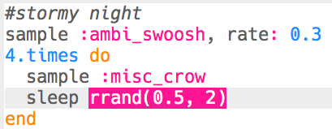

## तूफानी रात

+ अगला विशेष प्रभाव बनाने के लिए एक खाली बफर चुनें।

+ शुरू करने के लिए, `:ambi_swoosh` नमूना जोड़ें।

    

+ अपने नमूने का परीक्षण करने के लिए 'Run' दबाएँ और देखें कि इसकी आवाज़ कैसी लगती है।

+ यदि आप नमूने को धीमा कर देते हैं, तो आपको तूफान जैसी आवाज़ सुनाई देगी।

    

+ आप `:misc_crow` नमूना भी जोड़ सकते हैं, जो उसी समय चलता है।

    

+ `:misc_crow` नमूने को एक लूप में रखें, ताकि प्रत्येक बार चलाए जाने पर यह 1 बीट `sleep` के साथ 4 बार चलता है।

    

+ हर बार 1 बीट के लिए विश्राम के बजाय, आप `rrand` का उपयोग कर सकते हैं जो आपको कोष्ठक में 2 मानों के बीच एक यादृच्छिक संख्या देगा।

    

+ The __amplitude__ of a sound is the size of the sound wave. Changing the amplitude of a sound wave changes its __volume__.

    

    You can use `amp` to make a sample play at a different volume. A number less than 1 will play a sample quieter.

    

