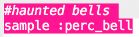
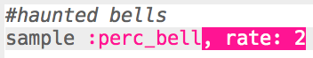
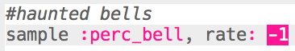
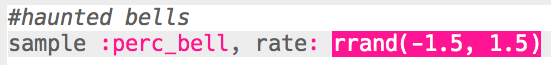
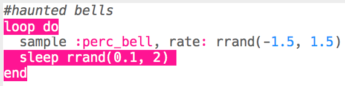

## भूतिया घंटियाँ

+ अगला विशेष प्रभाव बनाने के लिए एक खाली बफर चुनें।

+ `:perc_bell` नमूने को जोड़कर आरंभ करें।

    

+ नमूने को चलाने के लिए 'Run' दबाएँ और देखें कि इसकी आवाज़ कैसी लगती है।

+ यह देखने के लिए नमूने के `rate` को बदलें कि विभिन्न गतियों पर चलाए जाने पर इसमें से कैसी ध्वनियाँ निकलती हैं।

    

+ Change the `rate` to `-1`. What does this do to the sample?

    

+ नमूने को यादृच्छिक गति पर चलाने के लिए आप `rrand` का उपयोग कर सकते हैं।

    

+ Add the sample to a loop that repeats __forever__. You can also `sleep` for a random time after the sample is played.

    

