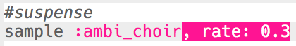

## Suspense

Cominciamo creando un suono per mostrare che il pericolo si sta avvicinando.

+ Per creare il primo effetto speciale devi aggiungere il campione `:ambi_choir ` in un buffer vuoto.
    
    

+ Puoi cambiare la **rate (frequenza)** alla quale viene eseguito un campione. Un `rate` di `1` è la velocità normale del campione, utilizzando un `rate` inferiore a 1 il campione rallenterà.
    
    

+ Premi 'Run' per sentire il tuo campione suonato lentamente. Come suona il campione?

+ Un `rate` superiore a 1 dà velocità al campione.
    
    

+ Prova nuovamente il campione. Come suona adesso?

+ Puoi ripetere il campione alcune volte inserendolo in un ciclo. Dovrai anche aggiungere `sleep` dopo aver riprodotto il campione.
    
    