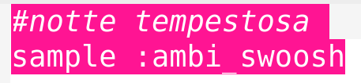
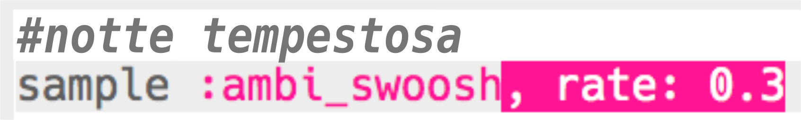
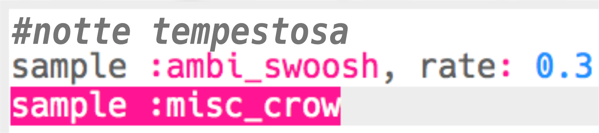
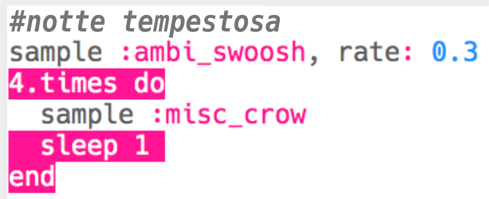
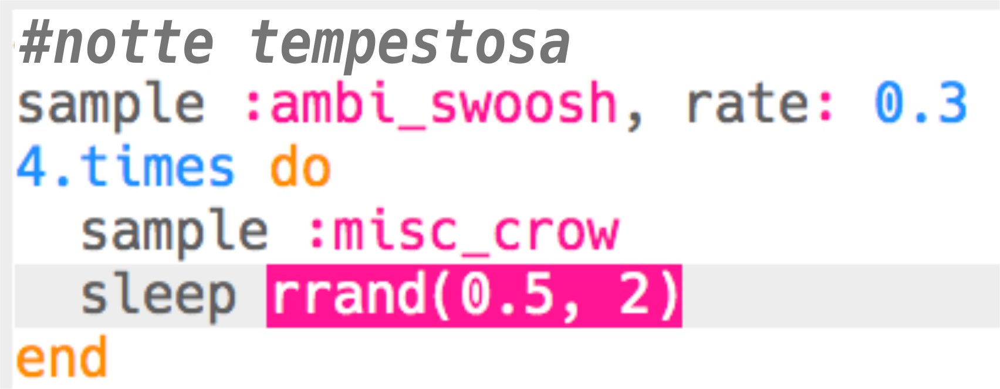
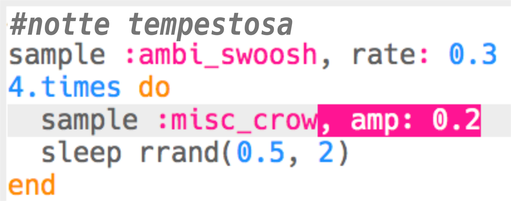

## Notte tempestosa

+ Scegliere un buffer vuoto per creare il prossimo effetto speciale.

+ Per iniziare, aggiungi il campione `:ambi_swoosh`.
    
    

+ Premi 'Run' per testare il tuo campione e sentire come suona.

+ Se rallenti il campione, sentirai che suona come una tempesta.
    
    

+ Puoi anche aggiungere un campione `:misc_crow` da riprodorre allo stesso tempo.
    
    

+ Metti il campione `:misc_crow` in un loop (ciclo), così che venga suonato 4 volte al ritmo di 1 `sleep`.
    
    

+ Invece di attendere 1 battito ogni volta, puoi usare `rrand` per ottenere un tempo casuale compreso tra i due valori inseriti in parentesi.
    
    

+ L'**ampiezza (amplitude)** di un suono è l'altezza dell'onda sonora. Cambiare l'ampiezza di un'onda sonora cambia il suo **volume**.
    
    
    
    Puoi usare `amp` per riprodurre un campione ad un volume diverso. Un valore inferiore a 1 suonerà il campione più silenziosamente.
    
    