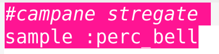
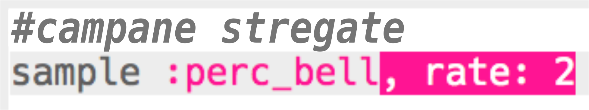
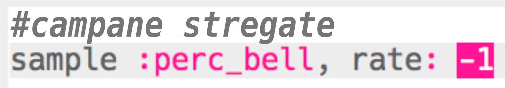
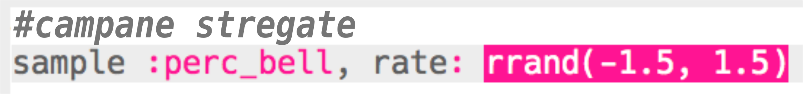
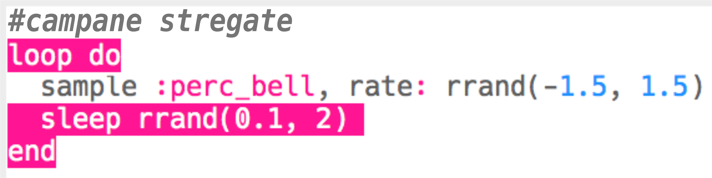

## Campane stregate

+ Scegliere un buffer vuoto per creare il prossimo effetto speciale.

+ Inizia aggiungendo il campione `:perc_bell`.
    
    

+ Premi 'Run' per provare il tuo campione e sentire come suona.

+ Cambia il `rate` del campione per vedere come suona a velocità diverse.
    
    

+ Imposta il `rate` a `-1`. Che cosa fa questo al campione?
    
    

+ Puoi usare `rrand` per riprodurre il campione a una velocità casuale.
    
    

+ Inserisci il campione dentro un loop che si ripete **per sempre**. Puoi anche inserire uno `sleep` di tempo casuale dopo che il campione è stato suonato.
    
    