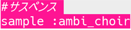
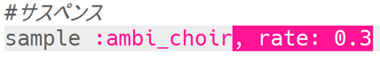
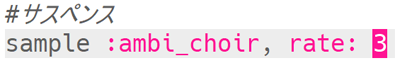
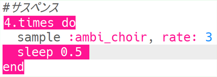

## サスペンス

危険が近づいていることを示す音をつくることからはじめましょう。

+ 最初の特殊効果（とくしゅこうか）をつくるには、サンプル音源`:ambi_choir`を空のバッファに追加する必要があります。
    
    

+ サンプル音源を再生する**rate**（速度）を変えられます。 `速度`が`1`のときがサンプル音源の通常の速度で、`速度`を1より小さくするとサンプル音源の速度が遅くなります。
    
    

+ 「Run」を押すとサンプル音源がゆっくり再生されます。 サンプル音源はどのように聞こえますか？

+ `rate`（速度）が1を超えると、サンプル音源の再生速度が上がります。
    
    

+ もう一度サンプル音源を試してみましょう。 今度はどのように聞こえますか？

+ ループの中に入れることで、サンプル音源を何回か繰り返すことができます。 サンプル音源を再生した後に`sleep`（休止）を入れる必要もあります。
    
    