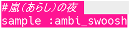
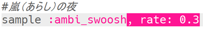
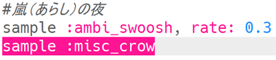
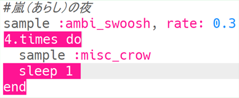
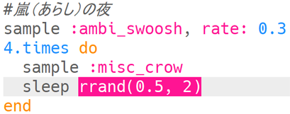
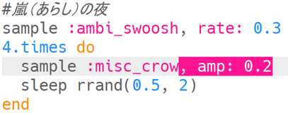

## 嵐（あらし）の夜

+ 空のバッファを選んで次の特殊効果（とくしゅこうか）をつくります。

+ まず、サンプル音源`:ambi_swoosh`を追加します。
    
    

+ 「Run」を押してサンプル音源を試して、どのように聞こえるか確認します。

+ サンプル音源の速度を遅くすると、嵐（あらし）のように聞こえます。
    
    

+ サンプル音源`:misc_crow`を追加することもできます。それは同時に再生されます。
    
    

+ ループの中に`:misc_crow`を入れると、再生されるたびに1拍の`sleep`（休止）が入って4回再生されます。
    
    

+ 毎回1拍の休止を入れるかわりに、かっこ内の2つの値の間の乱数が得られる`rrand`を使えます。
    
    

+ 音の**amplitude**（振幅（しんぷく））とは音波の大きさのことです。 音波の振幅（しんぷく）を変えると**volume**（音量）が変わります。
    
    
    
    `amp`（振幅（しんぷく））を使うとサンプル音源を別の音量で再生できます。 1より小さい数値にすると、サンプル音源をより静かに再生します。
    
    