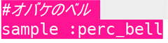
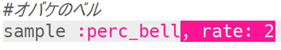
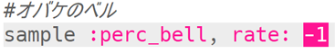
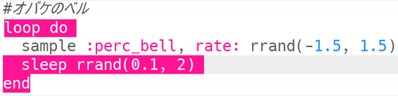

## Haunted bells

+ 空のバッファを選んで、次の特殊効果（とくしゅこうか）をつくります。

+ まず、サンプル音源`:perc_bell`を追加します。

    

+ 「Run」を押してサンプル音源を再生し、どのように聞こえるか確認します。

+ サンプル音源の`rate`（速度）を変えて、さまざまな速度でどのように再生されるか確認します。

    

+ `rate`（速度）を`-1`に変えます。 これはサンプル音源に何をしていますか？

    

+ ランダムな速度でサンプル音源を再生するのに`rrand`が使えます。

    

+ **forever**（ずっと）繰り返すループの中にサンプル音源を追加します。 サンプル音源が再生された後に、ランダムな時間だけ`sleep`（休止）することもできます。

    

