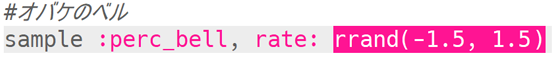

## Haunted bells

+ Choose an empty buffer to create the next special effect.

+ Start by adding the `:perc_bell` sample.
    
    

+ Press 'Run' to play the sample and see how it sounds.

+ Change the `rate` of the sample to see how it sounds played at different speeds.
    
    

+ Change the `rate` to `-1`. What does this do to the sample?
    
    

+ You can use `rrand` to play the sample at a random rate.
    
    

+ Add the sample to a loop that repeats **forever**. You can also `sleep` for a random time after the sample is played.
    
    