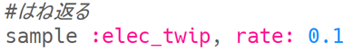

--- challenge ---

## チャレンジ：自分だけの特殊効果（とくしゅこうか）をつくる

サンプル音源を使って自分だけの特殊効果（とくしゅこうか）をつくることができますか？ 役に立つ例をいくつか示します：

特殊効果（とくしゅこうか）を**record**（保存）して、あなたがつくっている映画やゲームで使用できることを思い出してください！

--- /challenge ---

***
このプロジェクトは以下のボランティアによって翻訳されました。

齊藤哲哉

大野 雅利

ボランティアのおかげで、世界中の人々に母国語で学ぶ機会を与えることができます。翻訳を引き受けていただくことで、より多くの人々に手を差し伸べることができます。詳しくは [rpf.io/translate](https://rpf.io/translate) をご覧ください。