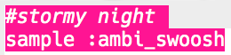

## 폭풍우 치는 밤

+ 다음 특수 효과를 만들려면 빈 버퍼를 선택하세요.

+ 시작하려면 `:ambi_swoosh` 샘플을 추가하세요.
    
    

+ 'run'을 눌러 샘플이 어떻게 들리는지 확인하세요.

+ 샘플 속도를 늦추면 마치 폭풍과 같은 소리를 듣을 수 있습니다.
    
    

+ 동시에 재생되는 `:misc_crow` 샘플을 추가할 수도 있습니다.
    
    

+ `:misc_crow` 샘플을 루프 안에 넣어 한 박씩 `sleep`하면서 네 번 재생되게 하세요.
    
    

+ 한 박씩 쉬는 대신, 괄호 안 두개의 값 사이의 (0.5와 2가 입력되면, 0.5에서 2 사이의 랜덤값 생성) 랜덤 수를 주는 `rrand`를 사용할 수 있습니다.
    
    

+ 음파의 **진폭**은 소리의 크기를 의미합니다. 음파의 진폭을 변경하면 **볼륨**을 변경할 수 있습니다.
    
    
    
    샘플을 다른 볼륨으로 재생하기 위해 `amp`를 사용할 수 있습니다. 1보다 작은 숫자는 샘플을 더 조용하게 재생합니다.
    
    