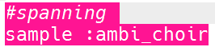
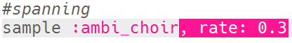
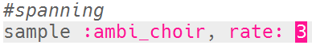
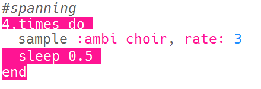

## Spanning

Laten we beginnen met het maken van een geluid om te laten zien dat er gevaar nadert.

+ Om het eerste speciale effect te creëren, moet je de `:ambi_choir` sample toevoegen aan een lege buffer.
    
    

+ Je kunt de <0>rate</0> (snelheid) wijzigen waarop een sample wordt afgespeeld. Een `rate` van `1` is de normale snelheid van de sample, en met een `rate` van minder dan 1 zal de sample vertragen.
    
    

+ Druk op 'Run' om je sample langzaam af te spelen. Hoe klinkt de sample?

+ Een `rate` hoger dan 1 versnelt de sample.
    
    

+ Test je sample nog eens. Hoe klinkt het nu?

+ Je kunt de sample een paar keer herhalen door het in een loop te zetten. Je zult ook een `sleep` toe moeten voegen na de sample.
    
    