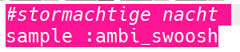
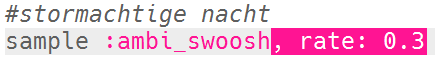
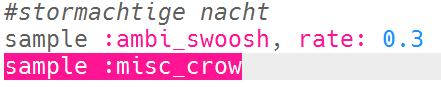
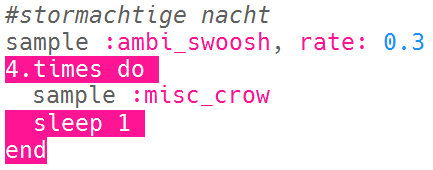
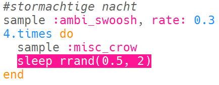
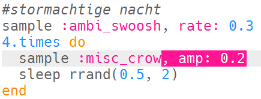

## Stormachtige nacht

+ Kies een lege buffer om het volgende speciale effect te maken.

+ Voeg de `:ambi_swoosh` sample toe om te beginnen.

    

+ Druk op 'Run' om je sample te testen en te zien hoe het klinkt.

+ Als je de sample vertraagt, hoor je dat het klinkt als een storm.

    

+ Je kunt ook een `:misc_crow` sample toevoegen, die tegelijkertijd wordt afgespeeld.

    

+ Zet de `:misc_crow` sample in een lus, zodat het 4 keer wordt gespeeld met een `sleep` van 1 tel telkens als het wordt afgespeeld.

    

+ In plaats van 1 tel te slapen kun je `rrand` gebruiken waarmee je een willekeurig getal tussen de 2 waarden in haakjes krijgt.

    

+ De **amplitude** van een geluid is de grootte van de geluidsgolf. Door de amplitude van een geluidsgolf te wijzigen, verandert het **volume**.

    

    Je kunt `amp` gebruiken om een sample te laten spelen met een ander volume. Een getal minder dan 1 zal een sample zachter spelen.

    

