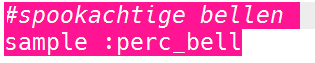
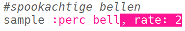
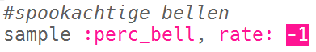
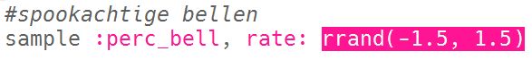
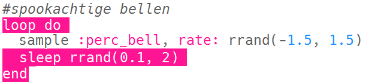

## Spookachtige bellen

+ Kies een lege buffer om het volgende speciale effect te maken.

+ Begin met het toevoegen van de `:perc_bell` sample.

    

+ Druk op 'Run' om de sample af te spelen en te zien hoe het klinkt.

+ Wijzig de `rate` van de sample om te zien hoe het klinkt met verschillende snelheden.

    

+ Verander de `rate` in `-1`. Wat doet dit met de sample?

    

+ Je kunt `rrand` gebruiken om de sample op een willekeurige snelheid af te spelen.

    

+ Voeg de sample toe aan een lus die **voor altijd** herhaalt. Je kunt ook een `sleep` met een willekeurige tijd doen nadat de sample is afgespeeld.

    

