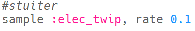
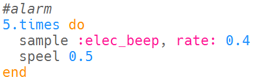

--- challenge ---

## Uitdaging: maak je eigen speciale effecten

Kun je samples gebruiken om je eigen speciale effecten te creëren? Hier zijn enkele voorbeelden om je te helpen:

Denk erom dat je je effecten kunt **record** (opnemen) en gebruiken in een film of spel dat je aan het ontwikkelen bent!

--- /challenge ---

***
Dit project werd vertaald door vrijwilligers:

Robert-Jan Kempenaar

Sanneke van der Meer

Dankzij vrijwilligers kunnen we mensen over de hele wereld de kans geven om in hun eigen taal te leren. Jij kunt ons helpen meer mensen te bereiken door vrijwillig te starten met vertalen - meer informatie op [rpf.io/translate](https://rpf.io/translate).