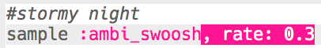

## Stormy night

+ Choose an empty buffer to create the next special effect.

+ To begin, add the `:ambi_swoosh` sample.
    
    

+ Press 'Run' to test your sample and see how it sounds.

+ If you slow the sample down, you'll hear that it sounds like a storm.
    
    

+ You could also add a `:misc_crow` sample, that is played at the same time.
    
    

+ Put the `:misc_crow` sample in a loop, so it is played 4 times with a 1 beat `sleep` each time it is played.
    
    

+ Instead of sleeping for 1 beat each time, you can use `rrand` to which will give you a random number between the 2 values in brackets.
    
    

+ The **amplitude** of a sound is the size of the sound wave. Changing the amplitude of a sound wave changes its **volume**.
    
    
    
    You can use `amp` to make a sample play at a different volume. A number less than 1 will play a sample quieter.
    
    