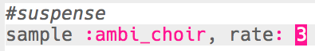
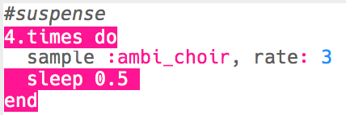

## Suspense

Vamos começar criando um som para mostrar que o perigo está se aproximando.

+ Para criar o primeiro efeito especial você deve adicionar o sample `:ambi_choir` ao buffer vazio.
    
    

+ Você pode alterar o **rate** no qual um sample é tocado. Um `rate` de `1` é a velocidade normal do sample e usar um `rate` de menos de 1 irá desacelerar o sample.
    
    

+ Pressione 'Run' para ouvir seu sample sendo reproduzido lentamente. Como o sample soa?

+ Um `rate` maior que 1 acelera o sample.
    
    

+ Teste seu sample novamente. Como soa agora?

+ Você pode repetir o sample algumas vezes colocando-o em um laço. Você também precisará adicionar um `sleep` depois de tocar o sample.
    
    