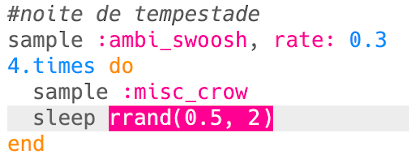

## Noite de tempestade

+ Escolha um buffer vazio para criar o próximo efeito especial.

+ Para começar, adicione o sample `:ambi_swoosh`.
    
    

+ Pressione 'Run' para testar seu sample e ver como ele soa.

+ Se você diminuir a velocidade do sample, ouvirá que ele soa como uma tempestade.
    
    

+ Você também pode adicionar um sample `:misc_crow`, que é reproduzido ao mesmo tempo.
    
    

+ Coloque o sample `:misc_crow` dentro de um laço, então ele é reproduzido 4 vezes com uma batida `sleep` toda vez que for tocado.
    
    

+ Em vez de dormir por 1 batida de cada vez, você pode usar `rrand` ao qual você fornecerá um número aleatório entre os 2 valores dentro dos parênteses.
    
    

+ A **amplitude** de um som é o tamanho da onda sonora. Alterando a amplitude de uma onda sonora muda seu **volume**.
    
    
    
    Você pode usar `amp` para reproduzir um sample em um volume diferente. Um número menor que 1 reproduzirá um sample mais silencioso.
    
    