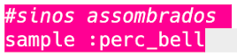
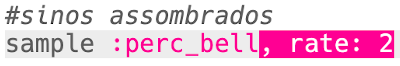
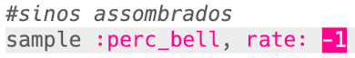
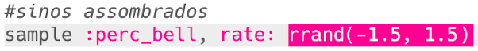
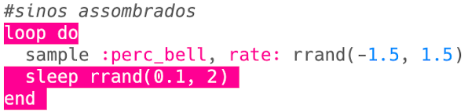

## Sinos assombrados

+ Escolha um buffer vazio para criar o próximo efeito especial.

+ Comece adicionando o sample `:perc_bell`.
    
    

+ Pressione 'Run' para testar o sample e ver como ele soa.

+ Altere o `rate` do sample para ver como ele soa tocado em diferentes velocidades.
    
    

+ Altere o `rate` para `-1`. O que isso faz com o sample?
    
    

+ Você pode usar `rrand` para tocar o sample a uma taxa aleatória.
    
    

+ Adicione o sample a um laço que se repete **para sempre**. Você também pode ter um tempo aleatório para `dormir` após a reprodução do sample.
    
    