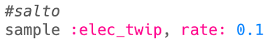

--- challenge ---

## Desafio: Crie seus próprios efeitos especiais

Você consegue usar samples para criar seus próprios efeitos especiais? Aqui estão alguns exemplos para ajudá-lo:

Lembre-se de que você pode **gravar** seus efeitos e usá-los em um filme ou jogo que você está desenvolvendo!

--- /challenge ---

***
Tradução Contribuída pela Comunidade

Este projeto foi traduzido por Douglas Reis e revisado por Flavio Silva.

Nossos incríveis voluntários de tradução nos ajudam a dar as crianças em todo o mundo a oportunidade de aprender a programar. Você pode nos ajudar a alcançar mais crianças traduzindo nossos projetos - leia mais em [rpf.io/translate](https://rpf.io/translate).